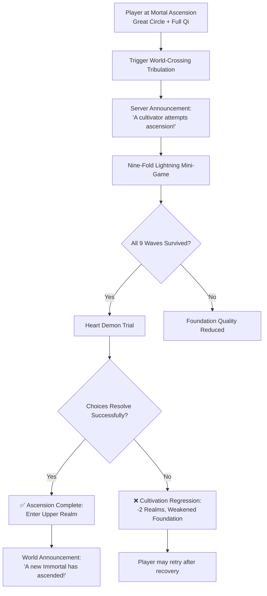

# 📜 Xianxia Evolution: Comprehensive Design Document
### *Version 2.0 — Dual-Plane Cultivation RPG*

> *"The path to immortality is paved with Qi, tested by lightning, and walked one breath at a time."*

---

## 📋 Table of Contents

1. [Overview](#-overview)
2. [Character Progression & Cultivation](#-character-progression--cultivation)
3. [The Great Barrier: World-Crossing Tribulation](#-the-great-barrier-world-crossing-tribulation)
4. [Upper Realm Mechanics](#-upper-realm-mechanics)
5. [Sect System](#-sect-system)
6. [Secret Realms & Exploration](#-secret-realms--exploration)
7. [Spiritual Pets & Mounts](#-spiritual-pets--mounts)
8. [Crafting & Professions](#-crafting--professions)
9. [Offline Progress: Meditation System](#-offline-progress-meditation-system)
10. [Premium & VIP Features](#-premium--vip-features)
11. [Technical Implementation](#-technical-implementation)
12. [Appendix: Glossary](#-appendix-glossary)

---

## 🎮 Overview

**Xianxia Evolution** is a browser-based incremental cultivation RPG inspired by classic Xianxia literature. Players begin as mortals with unawakened spirit roots and embark on a journey through **24 distinct realms** across two planes of existence, ultimately striving to become an **Eternal Sovereign** beyond time and fate.

### 🎯 Core Design Pillars

| Pillar | Description |
|--------|-------------|
| **Progression** | Meaningful advancement through 24 realms with tangible power growth |
| **Risk/Reward** | Breakthroughs carry real stakes; failure has consequences but not permadeath |
| **Narrative Depth** | Flavor text, tribulation trials, and lore that honors Xianxia traditions |
| **Accessibility** | Zero install, runs in any modern browser, auto-saves progress |
| **Replayability** | Reincarnation system with retained meta-progression |

### 🔄 Core Gameplay Loop

```
Meditate → Gather Qi/Essence → Explore → Breakthrough → Survive Tribulation → Ascend → Repeat
```

---

## 🧘 Character Progression & Cultivation

### 🔹 The 24 Realms of Progression

The path to immortality is divided into **two distinct planes**, each containing **12 major realms**. Every realm consists of **four cultivation stages**: `Early → Mid → Late → Great Circle`.

#### Lower Realm (Mortal Plane)

| # | Realm Name | Title | Description |
|---|------------|-------|-------------|
| 0 | Awaiting Birth | The Void Before | Soul suspended between lives, awaiting form |
| 1 | Body Refining | Tempering the Vessel | Strengthen flesh and bone through discipline |
| 2 | Qi Condensation | First Breath of the Dao | Sense and draw ambient Qi into meridians |
| 3 | Foundation Establishment | Roots Beneath Stone | Stabilize dantian; Qi no longer trembles |
| 4 | Core Formation | Heart of Still Water | Crystallize golden core; transcend mortal lifespan |
| 5 | Nascent Soul | The Infant God | Birth a spirit-self within; gain supernatural perception |
| 6 | Soul Transformation | Fire That Burns Inward | Purify soul essence; emerge harder, stranger |
| 7 | Void Refinement | Between Heaven and Ruin | Partially step outside mortal laws; space bends to intent |
| 8 | Body Integration | Flesh and Dao Unified | Physical and spiritual forms merge seamlessly |
| 9 | Great Perfection | Peak of Mortality | Extract all potential from mortal coil |
| 10 | Tribulation Transcendence | Facing Heaven's Wrath | Survive heavenly tests to earn ascension rights |
| 11 | Mortal Ascension | Threshold of Immortality | Stand at the Great Barrier; prepare for World-Crossing Tribulation |

#### Upper Realm (Immortal Plane)

| # | Realm Name | Title | Description |
|---|------------|-------|-------------|
| 12 | False Immortal | First Step Beyond Mortality | Crossed the Barrier; Immortal Essence infused but still fragile |
| 13 | True Immortal | Essence Awakened | Essence stabilizes; no longer age or fear mortal weapons |
| 14 | Heavenly Immortal | Bound to the Celestial Dao | Heaven acknowledges existence; command lesser spirits |
| 15 | Mystic Immortal | Weaver of Mysteries | Grasp hidden Dao patterns; spells bend without incantation |
| 16 | Golden Immortal | Body of Eternal Light | Form radiates golden luminescence; legend made flesh |
| 17 | Zenith Gold Immortal | Apex of Golden Dao | Summit of Golden Path; power rivals ancient sect founders |
| 18 | Immortal Monarch | Ruler of Sects | Command respect through presence; sects bow, realms negotiate |
| 19 | Immortal Emperor | Sovereign of Heavens | Name carved into reality; entire planes acknowledge sovereignty |
| 20 | Immortal Venerable | Ancient Power Awakened | Centuries distilled into primordial essence; remember forgotten epochs |
| 21 | Dao Ancestor | One with the Primordial Dao | No longer follow the Dao—you are its voice |
| 22 | God-King | Divine Authority Manifest | Transcend immortality concept; worshipped as deity |
| 23 | Eternal Sovereign | Beyond Time and Fate | Exist outside cycles of birth/death; final horizon reached |

### 🔹 Cultivation Mechanics

#### Qi Gathering Formula
```
Base Gain = 10 + (Realm Index × 5)
Spirit Root Bonus = Heavenly Saint Root ? +15 : 0
Stage Bonus = Stage Index × 2  // Early=0, Mid=1, Late=2, Great Circle=3
Plane Multiplier = Immortal ? 10 : 1

Total Gain = (Base + Spirit Root + Stage) × Plane Multiplier × Manor Bonus
```

#### Breakthrough Success Calculation
```
Base Chance = Realm Mechanics[Next Realm].success
Stage Bonus = Stage Index × 0.05
Manor Bonus = Jade Pillar Array owned ? +0.08 : 0

Final Chance = MIN(0.95, Base Chance + Stage Bonus + Manor Bonus)
```

#### Realm Mechanics Reference
```javascript
const realmMechanics = [
  // Mortal Realms (0-11): { ageLimit, success }
  { ageLimit: 75, success: 0.95 },    // 0 Awaiting Birth
  { ageLimit: 80, success: 0.90 },    // 1 Body Refining
  { ageLimit: 100, success: 0.80 },   // 2 Qi Condensation
  { ageLimit: 150, success: 0.70 },   // 3 Foundation Establishment
  { ageLimit: 300, success: 0.55 },   // 4 Core Formation
  { ageLimit: 600, success: 0.40 },   // 5 Nascent Soul
  { ageLimit: 1200, success: 0.30 },  // 6 Soul Transformation
  { ageLimit: 2500, success: 0.22 },  // 7 Void Refinement
  { ageLimit: 5000, success: 0.15 },  // 8 Body Integration
  { ageLimit: 10000, success: 0.10 }, // 9 Great Perfection
  { ageLimit: 20000, success: 0.06 }, // 10 Tribulation Transcendence
  { ageLimit: 50000, success: 0.03 }, // 11 Mortal Ascension
  
  // Immortal Realms (12-23)
  { ageLimit: 100000, success: 0.85 },   // 12 False Immortal
  { ageLimit: 200000, success: 0.75 },   // 13 True Immortal
  { ageLimit: 500000, success: 0.60 },   // 14 Heavenly Immortal
  { ageLimit: 1000000, success: 0.45 },  // 15 Mystic Immortal
  { ageLimit: 2000000, success: 0.30 },  // 16 Golden Immortal
  { ageLimit: 5000000, success: 0.20 },  // 17 Zenith Gold Immortal
  { ageLimit: 10000000, success: 0.12 }, // 18 Immortal Monarch
  { ageLimit: 20000000, success: 0.07 }, // 19 Immortal Emperor
  { ageLimit: 50000000, success: 0.04 }, // 20 Immortal Venerable
  { ageLimit: 100000000, success: 0.02 },// 21 Dao Ancestor
  { ageLimit: 999999999, success: 0.01 },// 22 God-King
  { ageLimit: 9999999999, success: 0.005 }// 23 Eternal Sovereign
];
```

---

## ⚡ The Great Barrier: World-Crossing Tribulation

The transition from **Realm 11 (Mortal Ascension)** to **Realm 12 (False Immortal)** is the most significant event in the game—a survival trial, not a menu click.

### 🔹 The "Shattering the Void" Event Flow



### 🔹 Nine-Fold Lightning Mini-Game

| Wave | Difficulty Modifier | Success Threshold Adjustment |
|------|-------------------|------------------------------|
| 1 | ×0.08 | Base Chance - 0.08 |
| 2 | ×0.16 | Base Chance - 0.16 |
| 3 | ×0.24 | Base Chance - 0.24 |
| 4 | ×0.32 | Base Chance - 0.32 |
| 5 | ×0.40 | Base Chance - 0.40 |
| 6 | ×0.48 | Base Chance - 0.48 |
| 7 | ×0.56 | Base Chance - 0.56 |
| 8 | ×0.64 | Base Chance - 0.64 |
| 9 | ×0.72 | Base Chance - 0.72 |

**Success Calculation per Wave:**
```
Wave Success = (Base Chance + Foundation Quality × 0.15 + Spirit Tools × 0.08) - Wave Difficulty
```

### 🔹 Heart Demon Trial

A narrative mini-game where players confront their character's past:

```javascript
const heartDemonChoices = [
  { 
    text: "Accept your regrets", 
    successMod: 0.15,
    flavor: "You acknowledge the paths not taken. Peace brings strength."
  },
  { 
    text: "Overcome through will", 
    successMod: 0.10,
    flavor: "Your determination burns away doubt. The demon recoils."
  },
  { 
    text: "Seek enlightenment", 
    successMod: 0.20,
    flavor: "You see beyond the illusion. The demon dissolves into wisdom."
  }
];
```

### 🔹 Failure Consequences

- **Cultivation Regression**: Drop 2 realms, reset to Early stage
- **Foundation Weakening**: `foundationQuality *= 0.85` (minimum 0.5)
- **Qi/Essence Loss**: Retain only 30% of current resources
- **No Permadeath**: Players may retry after recovery

---

## 🌌 Upper Realm Mechanics

Upon reaching the Upper Realm, the game environment and economy undergo fundamental shifts.

### 🔹 Immortal Essence Economy

| Currency | Plane | Conversion | Primary Use |
|----------|-------|------------|-------------|
| **Qi** | Mortal | Base unit | Meditation, breakthroughs, mortal exploration |
| **Immortal Essence (Eᵢ)** | Immortal | 1,000 Qi = 1 Essence | Advanced cultivation, Divine Grottoes, sect management |

**Conversion Utility:**
```javascript
function convertQiToEssence(qiAmount) {
  return Math.floor(qiAmount / 1000);
}
```

### 🔹 Divine Grottoes (Procedural Secret Realms)

Exclusive to Upper Realm players. Each visit generates a unique instance with randomized rewards.

| Grotto Type | Rarity | Dao Fragment Chance | Essence Bonus | Special Loot Chance |
|-------------|--------|-------------------|---------------|-------------------|
| Cloud-Piercing Peak | Common | 10% | 10-30 | 5% Spirit Tool |
| Abyssal Spirit Cave | Rare | 35% | 30-80 | 15% Spirit Tool |
| Primordial Dao Spring | Legendary | 70% | 80-200 | 30% Spirit Tool + Rare Artifact |

**Dao Fragments**: Used to transcend skills beyond maximum level or unlock unique abilities.

### 🔹 Sect Ascendance System

Players who reach False Immortal (Realm 12) may found an **Ascended Sect** spanning both realms.

#### Sect Structure
```
Ascended Sect (Immortal Leader)
├─ Core Elders (Immortal Realm disciples)
├─ Inner Disciples (Upper/Lower Realm hybrids)
└─ Vassal Disciples (Lower Realm players who pledge allegiance)
```

#### Vassal Disciple Mechanics
- Lower Realm players may join an Ascended Sect as Vassals
- Vassals gain +5% offline cultivation bonus
- Sect Leader gains +2% offline bonus per Vassal (capped at +20%)
- Vassals may be called upon for sect missions or tribulation witness events

#### Sect Ranks & Progression
| Rank | Requirement | Passive Bonus |
|------|------------|---------------|
| Emerging | Found sect | +5% offline gain |
| Established | 3+ Vassals | +8% offline gain, unlock Sect Missions |
| Renowned | 10+ Vassals, 1 Immortal Elder | +12% offline gain, unlock Sect Treasury |
| Sovereign | 25+ Vassals, Realm 18+ Leader | +20% offline gain, cross-realm teleportation |

---

## 🏯 Sect System (Lower Realm)

Sects serve as primary hubs for progression, social interaction, and resource acquisition in the Mortal Plane.

### 🔹 Disciple Ranks

| Rank | Benefits | Responsibilities | Unlock Requirement |
|------|----------|-----------------|-------------------|
| **Outer Disciple** | Basic Qi manual, shared housing, sect protection | Manual labor, basic missions, resource gathering | Join any sect |
| **Inner Disciple** | Advanced techniques, spirit stone stipend, personal storage | Resource guarding, combat duties, sect tournaments | Core Formation + Sect Contribution |
| **Core Disciple** | Personal cave manor, Elder guidance, breakthrough assistance | Represent sect in inter-sect events, mentor Outer Disciples | Nascent Soul + Elder Recommendation |
| **Elder** | Control over sect treasury branches, law proposal rights | Sect management, strategic warfare, disciple evaluation | Soul Transformation + Sect Leader Appointment |
| **Sect Leader** | Full treasury control, sect name customization, alliance formation | Overall strategy, diplomacy, final authority on sect matters | Found sect or win leadership challenge |

### 🔹 Sect Contribution System

Players earn **Sect Contribution Points (SCP)** through:
- Completing sect missions (+10-100 SCP)
- Donating resources (+1 SCP per 10 Gold/Spirit Stones)
- Winning inter-sect tournaments (+50-200 SCP)
- Recruiting new disciples (+25 SCP per recruit)

**SCP Redemption**:
```
50 SCP  = Advanced Technique Manual
150 SCP = Breakthrough Assistance Pill (+10% success)
300 SCP = Personal Manor Upgrade
500 SCP = Elder Recommendation Letter
```

---

## 🗺️ Secret Realms & Exploration

Limited-time instances offering high-risk, high-reward opportunities.

### 🔹 Types of Secret Realms

| Type | Description | Key Rewards | Risk Level |
|------|-------------|-------------|------------|
| **Ancient Ruins** | Deserted sect sites with collapsed formations | Lost manuals, broken artifacts, historical lore | Medium |
| **Natural Grottoes** | Areas with hyper-concentrated Qi or rare herbs | Spirit Herbs, Qi Crystals, temporary cultivation boosts | Low-Medium |
| **Bloodline Inheritance** | Rare encounters with fallen Immortal legacies | Bloodline skills, unique pets, permanent stat boosts | High |
| **Heavenly Treasure Vault** | Endgame raid requiring sect coordination | Legendary artifacts, realm advancement items | Very High |

### 🔹 Exploration Mechanics

```javascript
function exploreSecretRealm(realmType) {
  // Determine encounter pool based on realm type and player realm
  const encounters = getEncounterPool(realmType, gameState.realmIndex);
  
  // Roll for encounter
  const encounter = weightedRandom(encounters);
  
  // Resolve encounter
  switch(encounter.type) {
    case 'combat':
      return resolveCombat(encounter);
    case 'treasure':
      return grantReward(encounter.reward);
    case 'puzzle':
      return solveFormationPuzzle(encounter);
    case 'narrative':
      return triggerLoreEvent(encounter);
  }
}
```

### 🔹 Competition & PvP Elements

- **Realm Locks**: Only one player/sect may claim certain treasures per instance
- **Ambush Mechanics**: Players may be ambushed by rivals while exploring
- **Truce System**: Temporary alliances allowed for high-difficulty content
- **Reputation System**: Aggressive PvP actions affect sect standing and NPC interactions

---

## 🐉 Spiritual Pets & Mounts

Companions that assist in combat, resource gathering, and cultivation.

### 🔹 Contracting System

| Method | Requirement | Success Rate | Notes |
|--------|------------|--------------|-------|
| **Force Subjugation** | Combat Power > Beast Level | 20-60% | Risk of injury if failed |
| **Spirit Bait** | Crafted item + appropriate biome | 40-80% | Consumes bait regardless of outcome |
| **Blood Oath** | Nascent Soul+ + Beast's consent | 100% | Requires narrative quest completion |
| **Inheritance Bond** | Specific bloodline compatibility | 100% | Rare; grants unique evolution path |

### 🔹 Pet Evolution Trees

```
Spirit Snake (Common)
├─ Flood Dragon (Rare) ──► Azure Dragon (Legendary)
├─ Venom Wyrm (Rare) ──► Poison Sovereign (Epic)
└─ Scale Guardian (Uncommon) ──► Mountain Protector (Rare)

Phoenix Chick (Legendary - Inheritance Only)
└─ Vermilion Phoenix (Mythic) ──► Primordial Fire Bird (Unique)
```

### 🔹 Pet Mechanics

| Feature | Description | Unlock Requirement |
|---------|-------------|-------------------|
| **Passive Aura** | Pets provide stat bonuses while active | Contract any pet |
| **Auto-Gather** | Pets collect resources while player is offline | Pet Level 10+ |
| **Combat Assist** | Pets join battles with unique abilities | Pet Level 20+ |
| **Bloodline Awakening** | Use rare pills to unlock ancestral powers | Core Formation + Specific Item |
| **Mount Form** | High-level pets may serve as transportation | Nascent Soul + Pet Evolution |

### 🔹 Pet Stats & Growth

```javascript
const petBaseStats = {
  health: 100,
  qiReserve: 50,
  combatPower: 15,
  gatheringEfficiency: 1.0,
  loyalty: 100 // Affects obedience and evolution chance
};

// Growth formula per level
function calculatePetGrowth(pet, level) {
  return {
    health: pet.baseHealth * (1 + level * 0.12),
    qiReserve: pet.baseQi * (1 + level * 0.08),
    combatPower: pet.baseCombat * (1 + level * 0.15),
    // Loyalty decays if neglected; boosted by gifts/interaction
    loyalty: Math.max(0, pet.loyalty - (daysNeglected * 2) + (giftsGiven * 5))
  };
}
```

---

## ⚗️ Crafting & Professions

Supporting systems to enhance the primary cultivation path.

### 🔹 Profession Overview

| Profession | Primary Output | Key Resources | Unlock Requirement |
|------------|---------------|---------------|-------------------|
| **Alchemy** | Pills for breakthroughs, stat boosts, healing | Spirit Herbs, Qi Crystals, Pure Water | Qi Condensation + Alchemy Manual |
| **Blacksmithing** | Spirit tools, armor, life-bound treasures | Spirit Metals, Beast Bones, Formation Cores | Foundation Establishment + Forge Access |
| **Array Formation** | Defensive circles, Qi-gathering arrays, teleportation gates | Spirit Stones, Rare Minerals, Insight Points | Core Formation + Array Theory Study |
| **Talisman Crafting** | Single-use buffs, traps, communication charms | Spirit Paper, Beast Blood, Ink of Insight | Qi Condensation + Talisman Basics |

### 🔹 Alchemy System Deep Dive

#### Pill Tiers
```
Mortal Tier (Realms 1-6):
├─ Qi Recovery Pill (+20% Qi instantly)
├─ Foundation Stabilizer (+5% breakthrough success)
├─ Longevity Elixir (+1 year max age)
└─ Heart-Calming Powder (Reduce tribulation stress)

Immortal Tier (Realms 12+):
├─ Essence Condensation Pill (+15% Essence gain)
├─ Dao-Comprehension Elixir (Temporary insight boost)
├─ Tribulation Resistance Charm (One-time lightning mitigation)
└─ Immortal Body Refinement Pill (Permanent stat increase)
```

#### Crafting Formula Structure
```javascript
const pillRecipes = {
  "Foundation Stabilizer": {
    tier: "Mortal",
    ingredients: [
      { item: "Spirit Herb: Calming Grass", qty: 3 },
      { item: "Qi Crystal: Fragment", qty: 1 },
      { item: "Pure Spring Water", qty: 1 }
    ],
    successBase: 0.75,
    alchemyLevelBonus: 0.02, // +2% per alchemy skill level
    output: {
      type: "consumable",
      effect: "breakthroughBonus",
      value: 0.05,
      duration: "one-time"
    }
  }
};
```

### 🔹 Blacksmithing: Life-Bound Treasures

Unique items that grow with their owner:

```javascript
// Life-bound treasure progression
const lifeBoundProgression = [
  { stage: "Mortal Artifact", realmReq: 0, bonus: "+5% Combat Power" },
  { stage: "Spirit Tool", realmReq: 3, bonus: "+10% Qi Gain" },
  { stage: "Core-Bound Treasure", realmReq: 4, bonus: "+15% Breakthrough Success" },
  { stage: "Soul-Linked Artifact", realmReq: 5, bonus: "Unlock Unique Ability" },
  { stage: "Dao-Integrated Treasure", realmReq: 12, bonus: "+20% Essence Gain" },
  { stage: "Immortal Legacy", realmReq: 16, bonus: "Passive Realm Aura" }
];
```

### 🔹 Array Formation Mechanics

Arrays are placed in personal manors or sect territories:

| Array Type | Effect | Resource Cost | Duration |
|------------|--------|---------------|----------|
| **Qi Gathering Circle** | +10% meditation gain in area | 50 Spirit Stones | Permanent |
| **Defensive Ward** | Reduce damage from ambushes by 30% | 100 Spirit Stones + Formation Core | 7 days |
| **Teleportation Gate** | Instant travel between unlocked locations | 200 Spirit Stones + Rare Mineral | Permanent |
| **Insight Meditation Array** | +15% Insight Point gain | 75 Spirit Stones + Insight Crystal | 24 hours |

---

## 🌙 Offline Progress: Meditation System

Ensuring growth continues even when the player is away.

### 🔹 Secluded Cultivation Formula

```
Total Offline Gain = (Time Offline × Base Rate) × (Spiritual Density + Pet Bonus) × Manor Multiplier × Sect Bonus

Where:
• Time Offline = minutes since last login
• Base Rate = 5 Qi/min (Mortal) or 50 Qi/min (Immortal = 5 Essence/min)
• Spiritual Density = 1.0 (starter) to 10.0 (late-game locations)
• Pet Bonus = 0.0 to 2.0 (based on pet level and gathering skill)
• Manor Multiplier = 1.0 + (0.05 × Spirit Spring Pond upgrades)
• Sect Bonus = 1.0 + (0.02 × Vassal Disciples) [Leader only]
```

### 🔹 Location Spiritual Density Reference

| Location Type | Plane | Density Range | Unlock Requirement |
|---------------|-------|---------------|-------------------|
| Mortal Village | Mortal | 1.0 - 2.0 | Starting area |
| Sect Territory | Mortal | 2.5 - 4.0 | Join sect |
| Spirit Mountain | Mortal | 4.5 - 7.0 | Foundation Establishment |
| Ancient Forest | Mortal | 6.0 - 8.5 | Core Formation |
| Void Rift | Mortal | 8.0 - 10.0 | Nascent Soul |
| Immortal City | Immortal | 3.0 - 5.0 | False Immortal |
| Celestial Peak | Immortal | 6.0 - 9.0 | True Immortal |
| Dao Source Spring | Immortal | 9.0 - 12.0 | Mystic Immortal |

### 🔹 Auto-Looting System

Players may assign pets or sect disciples to gather while offline:

```javascript
function calculateAutoLoot(pet, timeMinutes, locationDensity) {
  const baseYield = pet.gatheringEfficiency * 0.5; // Items per minute baseline
  const densityMod = Math.min(2.0, locationDensity / 5.0);
  const luckFactor = 0.8 + Math.random() * 0.4; // 0.8-1.2 variance
  
  return {
    spiritStones: Math.floor(baseYield * densityMod * luckFactor * timeMinutes * 0.3),
    herbs: Math.floor(baseYield * densityMod * luckFactor * timeMinutes * 0.2),
    rareDropChance: Math.min(0.15, baseYield * 0.01 * timeMinutes) // Max 15% chance
  };
}
```

### 🔹 Insight Points System

Offline meditation also generates **Insight Points** used for:
- Unlocking advanced techniques
- Comprehending formation diagrams
- Accelerating pet evolution
- Deciphering ancient lore texts

```
Insight Gain = (Time Offline / 60) × (Realm Index + 1) × (0.5 + Spiritual Density × 0.1)
```

---

## 💎 Premium & VIP Features

Monetization designed for convenience and aesthetic variety—never pay-to-win core progression.

### 🔹 Immortal Jade Store

**Currency**: Immortal Jade (🪙) — earned via gameplay or optional purchase

| Item Category | Examples | Price Range | Effect |
|---------------|----------|-------------|--------|
| **Visual Skins** | Celestial Robe, Dragon Scale Armor, Moonlight Veil | 50-150 🪙 | Cosmetic only; no stat changes |
| **Aura Trails** | Phoenix Flame, Azure Dragon Mist, Starfall Cascade | 75-200 🪙 | Visual particle effects |
| **Convenience** | Realm Hop Charm (instant travel), Inventory Expansion | 100-300 🪙 | Quality-of-life improvements |
| **Expression** | Emote Packs, Title Frames, Nameplate Effects | 25-75 🪙 | Social customization |

### 🔹 Heavenly Path Pass (Seasonal Battle Pass)

A free + premium track resetting every 8 weeks:

#### Free Track Rewards
```
Level 5:  Pill Recipe: Foundation Stabilizer
Level 10: Pet Bloodline Catalyst (Common)
Level 15: 10 Immortal Jade
Level 20: Dao Fragment ×1
Level 25: Exclusive Title: "Path Walker"
Level 30: 25 Immortal Jade
```

#### Premium Track Rewards (+$4.99 or 500 🪙)
```
Level 5:  Pill Recipe: Heart-Calming Powder + Free Reward
Level 10: Pet Bloodline Catalyst (Rare) + Free Reward
Level 15: Spirit Spring Pond Upgrade + Free Reward
Level 20: Exclusive Aura: Phoenix Flame + Free Reward
Level 25: Dao Fragment ×3 + Free Reward
Level 30: 100 Immortal Jade + Exclusive Mount Skin
```

### 🔹 VIP Manor Upgrades

Functional + aesthetic upgrades for personal cultivation spaces:

| Upgrade | Cost | Effect | Description |
|---------|------|--------|-------------|
| **Spirit Spring Pond** | 200 🪙 | +5% offline Qi/Essence gain | Mystical pond amplifies meditation energy |
| **Jade Pillar Array** | 350 🪙 | +8% breakthrough success chance | Ancient pillars stabilize cultivation attempts |
| **Starlight Pavilion** | 500 🪙 | +10% cultivation gain | Serene pavilion enhances focus and Qi absorption |
| **Dao Insight Garden** | 750 🪙 | +15% Insight Point gain | Garden of enlightenment accelerates comprehension |
| **Tribulation Ward** | 1000 🪙 | One-time lightning mitigation | Protective formation for World-Crossing attempts |

### 🔹 Monetization Philosophy

✅ **Allowed**:
- Cosmetic items with no gameplay impact
- Time-saving conveniences (not progression locks)
- Optional battle pass with generous free track
- Supporter perks that don't create power gaps

❌ **Prohibited**:
- Selling realm advancement or breakthrough success
- Exclusive realms/realms locked behind paywall
- Stats that cannot be earned through gameplay
- Aggressive pop-ups or energy systems

---

## ⚙️ Technical Implementation

### 🔹 Architecture Overview

```
Client-Side Only (No Backend Required)
├─ index.html      → Game interface, modals, responsive layout
├─ script.js       → Core engine: state management, game loop, actions
├─ style.css       → Themed CSS with animations, responsive design
├─ lore.js         → Narrative content: realms, events, flavor text
└─ localStorage    → Save system with versioned migration support
```

### 🔹 Save System Design

```javascript
// Save structure with versioning for migration
const saveTemplate = {
  version: "2.0",
  timestamp: Date.now(),
  gameState: {
    // Core progression
    qi: 0,
    essence: 0,
    realmIndex: 0,
    realmStage: "Early",
    plane: "mortal",
    
    // Character
    age: 0,
    maxAge: 70,
    spiritRoot: "Unawakened",
    lineage: "None",
    foundationQuality: 1.0,
    
    // Resources
    gold: 0,
    jade: 0,
    spiritTools: [],
    daoFragments: 0,
    
    // Systems
    sect: null,
    manorUpgrades: [],
    unlockedCosmetics: [],
    passLevel: 1,
    passRewardsClaimed: [],
    
    // Meta
    isDead: false,
    lastLogin: null,
    offlineBonus: 1.0
  }
};

// Migration function for future updates
function migrateSave(savedData) {
  if (!savedData.version) savedData.version = "1.0";
  
  // v1.0 → v2.0 migration example
  if (savedData.version === "1.0") {
    savedData.gameState.essence = 0;
    savedData.gameState.plane = "mortal";
    savedData.gameState.realmStage = "Early";
    savedData.version = "2.0";
  }
  
  return savedData;
}
```

### 🔹 Performance Optimizations

- **Log Pruning**: Auto-limit to 200 entries to prevent memory bloat
- **Efficient DOM Updates**: Batch UI changes in `updateUI()`; avoid per-action reflows
- **CSS Animations**: Use `transform`/`opacity` for GPU-accelerated effects
- **Debounced Saves**: Auto-save every 30s + on major progression events
- **Lazy Lore Loading**: Only render Inner Eye content when menu opens

### 🔹 Browser Compatibility

| Feature | Chrome | Firefox | Safari | Edge | Mobile |
|---------|--------|---------|--------|------|--------|
| Core Gameplay | ✅ 88+ | ✅ 85+ | ✅ 14+ | ✅ 88+ | ✅ iOS 14+/Android 10+ |
| CSS Animations | ✅ | ✅ | ✅ | ✅ | ✅ (reduced motion respected) |
| localStorage | ✅ | ✅ | ✅ | ✅ | ✅ |
| Responsive Layout | ✅ | ✅ | ✅ | ✅ | ✅ (320px+ viewport) |

### 🔹 Debug & Modding Support

**Debug Mode** (append `?debug=true` to URL):
```javascript
// Available console commands in debug mode:
> debug.jumpToRealm(11)        // Jump to Mortal Ascension
> debug.grantEssence(1000)     // Add Immortal Essence
> debug.triggerTribulation()   // Force World-Crossing event
> debug.resetProgress()        // Wipe save (with confirmation)
```

**Planned Modding API** (v3.0):
```javascript
// Future: Custom content registration
XianxiaAPI.registerRealm({
  id: 24,
  name: "Custom Realm",
  plane: "immortal",
  description: "Player-created content",
  // ... additional properties
});

XianxiaAPI.registerEvent({
  tag: "custom",
  plane: "immortal",
  condition: (state) => state.daoFragments >= 5,
  msg: "Your custom narrative event text here"
});
```

---

## 📚 Appendix: Glossary

| Term | Definition |
|------|------------|
| **Qi (Chi)** | Vital energy cultivated to strengthen body and soul; primary mortal currency |
| **Immortal Essence (Eᵢ)** | Refined cosmic energy of the Upper Realm; 1,000 Qi = 1 Essence |
| **Dantian** | Energy center in the lower abdomen; stores and refines Qi/Essence |
| **Meridians** | Energy channels through which Qi flows; must be strengthened to advance |
| **Spirit Root** | Innate talent determining cultivation speed and ceiling (Mortal/Earthly/Heavenly Saint) |
| **Foundation Quality** | Hidden stat (0.5-2.0) affecting tribulation success and breakthrough stability |
| **Great Circle** | Final stage of any realm; prerequisite for attempting ascension |
| **World-Crossing Tribulation** | Nine-wave lightning trial + Heart Demon challenge to enter Upper Realm |
| **Dao Fragment** | Rare item from Divine Grottoes; used to transcend skills beyond limits |
| **Vassal Disciple** | Lower Realm player who pledges to an Ascended Sect for mutual bonuses |
| **Insight Points** | Meta-currency from meditation; unlocks techniques and comprehension |
| **Immortal Jade** | Premium currency for cosmetics and conveniences; never required for progression |
| **Heavenly Path Pass** | Seasonal battle pass with free and premium reward tracks |
| **Reincarnation** | End-of-life reset that retains meta-progression (Pass level, cosmetics, Jade) |

---

## 🔄 Version History

| Version | Date | Key Changes |
|---------|------|-------------|
| **1.0** | 2024-Q3 | Initial release: 12 mortal realms, basic cultivation loop |
| **1.5** | 2024-Q4 | Added Sect system, Pets, Crafting professions |
| **2.0** | 2026-Q2 | Dual-plane expansion: 24 realms, World-Crossing Tribulation, Immortal Essence, Divine Grottoes, Premium features |
| **2.1** | Planned | Pet evolution trees, cross-realm sect missions, modding API |
| **3.0** | Planned | Multiplayer witness system, guild wars, mobile app wrapper |

---

**Inspirations & Acknowledgements**:
- 📚 Literary: *I Shall Seal the Heavens*, *A Will Eternal*, *Coiling Dragon*, *Renegade Immortal*
- 🎮 Mechanical: *Kittens Game*, *Universal Paperclips*, *Candy Box 2*, *Adventure Capitalist*
- 🎨 Visual: *Wuthering Waves*, *Genshin Impact* cultivation systems, traditional Chinese art motifs
- 👥 Community: Playtesters, lore contributors, and early cultivators who shaped v2.0

---

> *"Heaven rewards the persistent. The Dao favors the prepared.  
> May your cultivation be swift, your tribulations survivable,  
> and your journey to immortality unforgettable."* 🌀

<p align="center">
  <sub><strong>Xianxia Evolution v2.0</strong> • Made with ☯️ by Thana Studios • Cultivate Responsibly</sub>
</p>